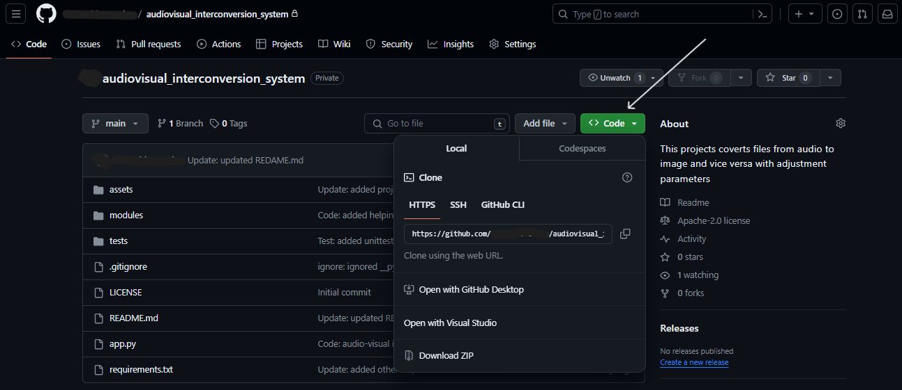
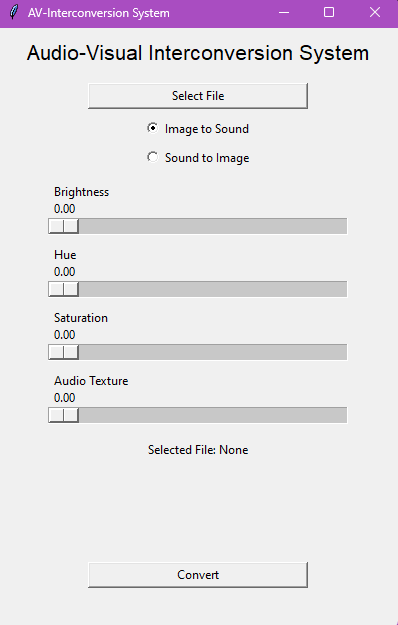
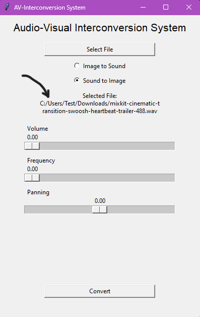
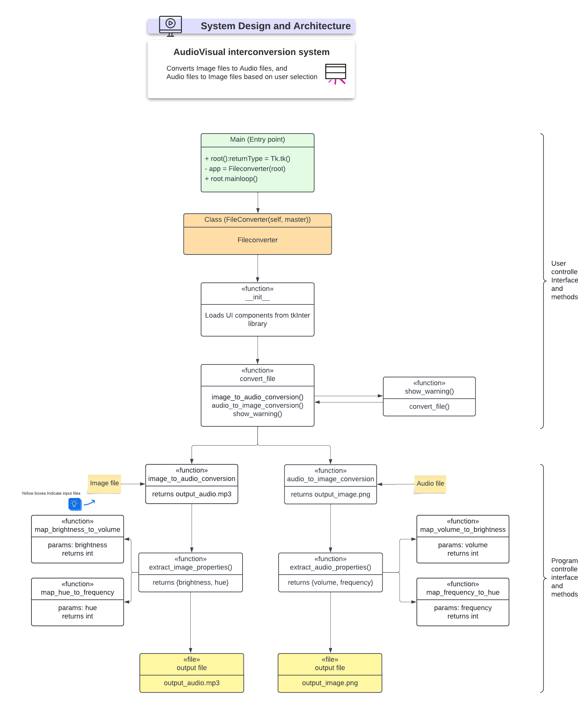

# Audiovisual_interconversion_system
Interconvert audio and visual files using a User Interface, with adjustment parameters for image and audio properties.


## Introduction
The Audiovisual Interconversion System is a Python-based application that allows users to convert visual and audio files into each other. The system provides a user interface to select input files and adjust parameters for the conversion process.

## Setup
1. In the project page, click on the "Code" button and copy the project URL.



2. Go to the terminal (you can click on the start button of your computer and type `CMD` in the search box). Then run the following commands to clone the repository and navigate to the project folder:
```bash
git clone <project_url>
```
3. Change your directory to the project name
```bash
cd <project_name>
```
4. Open up your terminal and Install the required dependencies using pip. Run the following command in the terminal to install the dependencies from the requirements.txt file:
```bash
pip install -r requirements.txt
```

## Usage
Run the following command to start the UI:
```bash
python app.py
```
The UI will open, allowing users to choose the direction of conversion
### Image to Sound


OR

### Sound to Image


With the file path updated in the UI, users can then adjust the parameters for the conversion, then click the "Convert" button to finally start the conversion process.

An output audio or visual file will be generated based on the selected direction of conversion.


## Libraries
- **Pillow**: A Python Imaging Library that adds image processing capabilities to your Python interpreter.
- **Pydub**: A high-level audio processing library for Python that makes it easy to work with audio files.
- **Tkinter**: A standard Python interface to the Tk GUI toolkit.

## System Design and Architecture

### System Blueprint:
The system is designed to interconvert visual and audio files through a user interface. It supports two main tasks:
- Image to Audio Conversion
- Audio to Image Conversion

The architecture consists of three main components:
- Image Processing Module
- Audio Processing Module, and
- A User Interface to initiate the process.

### Image Processing Module:
- Utilizes the Pillow library for scanning images pixel by pixel.
- Extracts properties such as brightness, hue, and saturation from the image.
- Translates these properties into corresponding audio parameters, including volume, frequency, and overtones.

### Audio Processing Module:
- Employs Pydub to generate audio files based on translated parameters.
- Supports reverse processing, extracting properties from audio files.
- Translates audio parameters back into visual properties for image creation.

### User Interface:
- Developed using Tkinter for a user-friendly experience.
- Offers sliders and input fields for parameter adjustment in both tasks.
- Allows users to select the conversion direction (visual to audio or audio to visual).
- Provides options to choose input files and adjust conversion parameters.

## Data Flow Diagram:
```sql
              +-------------------+
              |   User Interface  |
              +---------+---------+
                        |
                        v
              +---------+---------+
              | Image Processing  |  <--(Task 1)
              |     Module        |  --- Extracts properties from images
              +---------+---------+
                        |
                        v
              +---------+---------+
              | Audio Processing  |  <--(Task 2)
              |     Module        |  --- Extracts properties from audio
              +---------+---------+
                        |
                        v
              +-------------------+
              |   File Conversion  |
              +-------------------+
```

## User Interface Design:
### Main Interface:
- Dropdown or radio buttons to select conversion direction (visual to audio or audio to visual).
- Input field/button for selecting the input file (image for Task 1, audio for Task 2).

### Parameter Adjustment:
- Sliders for adjusting brightness, hue, saturation, volume, frequency, and overtones.
- Input fields for precise parameter input.

### Conversion Action:
- Button to initiate the conversion process.
- Display area for status updates and notifications.

## Footnotes
You can install extensions for viewing the geenrated audio and image files. I recommend using the following extensions:
```txt
For audio files:
    Name: audio-preview
    Id: sukumo28.wav-preview
    Description: play & preview audio file in VS Code. (wav,mp3,ogg,aac,flac,...etc)
    Version: 2.0.5
    Publisher: sukumo28
    VS Marketplace Link: https://marketplace.visualstudio.com/items?itemName=sukumo28.wav-preview

- For image files:
    Name: Image Preview
    Id: kisstkondoros.vscode-gutter-preview
    Description: Shows image previews in the gutter and on hover
    Version: 0.7.0
    Publisher: kisstkondoros
    VS Marketplace Link: https://marketplace.visualstudio.com/items?itemName=kisstkondoros.vscode-gutter-preview
```
